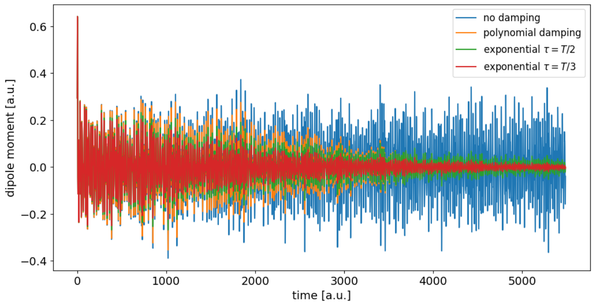
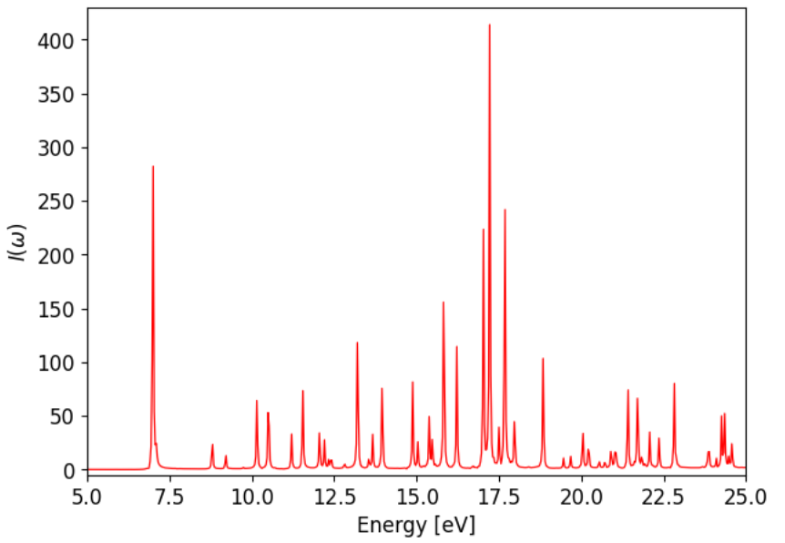

#########################
Linear absorption spectra
#########################

This tutorial explains how to compute (electronic) linear absorption spectra from the time-dependent dipole moment :math:`\mu (t)`. It is assumed here that :math:`\mu (t)` has already been calculated in case where a short pulse is applied in the beginnig. (I might do a tutorial on how to do Ehrenfest dynamics with a pulse in FHI-aims as well, if I have the time.)

******
Theory
******
The linear absorption :math:`I(\omega)` looks as follows

.. math::
        I(\omega) = \frac{8 \pi \omega}{3 c} \text{Re} \int_0^\infty dt e^{i \omega t} C_{\mu \mu} (t)

When the field is a delta-pulse 

.. math::
   E(t) = \kappa \delta (t - t_0)

the correlation function can be expressed in terms of the dipole moment :math:`\mu(t)`

.. math::
   C_{\mu \mu} (t) = \frac{-i}{\kappa} \langle \mu(t) - \mu(0) \rangle

if the field is weak :math:`\kappa \ll 1`.

For a single trajectory damping has to be applied to the dipole signal, such that it decays to zero towards the end of the trajectory :math:`T`. Polynomial damping can be done in this way

.. math::
   f(t) = 1 - 3x^2 + 2x^3 \quad \text{with} \quad x = t/T

And exponential damping 

.. math::
   f(t) = \exp (-t / \tau)

can also be used. In both cases the damping function :math:`f(t)` is just multiplied with the difference of the dipole :math:`\mu(t) - \mu(0)`. 

*******************
Example of benzene
*******************

Specifically, in FHI-aims with Ehrenfest dynamics, only the electronic dipole moment is output. The nuclear dipole moment has to be calculated seperately from the trajectory of the nuclei and added to it.

The evolution of the total (nuclear and electronic) dipole moment :math:`\mu (t)` looks like this

Before the fourier transform the dipole data before the field has been applied, or before the center :math:`t_0` of the pulse has to be deleted. In case of exponential damping different values the decay time parameter :math:`\tau` have to be tried out until it yields a completely positive spectrum. For benzene the final spectrum looks something like this

