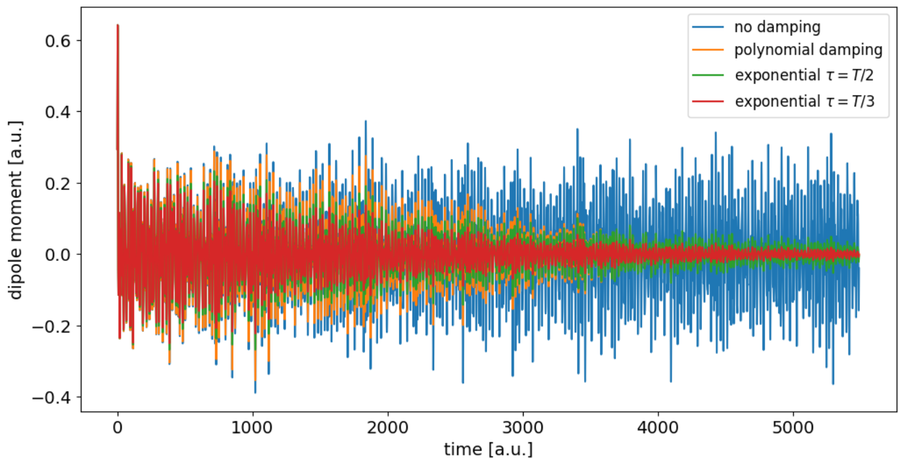
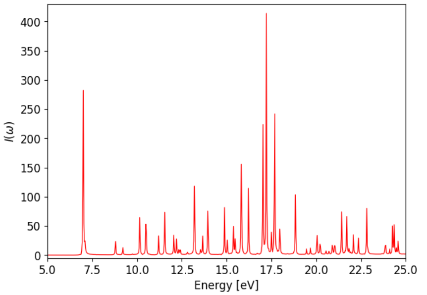

.. _abs-spectrum:
#########################
Linear absorption spectra
#########################

Contributed by Hannah Bertschi

This tutorial explains how to compute (electronic) linear absorption spectra from the time-dependent dipole moment :math:`\mu (t)`, which is computed after application of a delta-pulse. The tutorial :ref:`eh-dynamics` shows how that can be done. Example output for the absorption spectrum of benzene is shown as well.

******
Theory
******
The linear absorption :math:`I(\omega)` is given by the fourier transform of the time correlation function of the dipole in the interaction picture :math:`C_{\mu \mu} (t)`

.. math::
        I(\omega) = \frac{8 \pi \omega}{c} \text{Re} \int_{t_0}^\infty dt e^{i \omega t} C_{\mu \mu} (t).

When the field is a delta-pulse 

.. math::
   E(t) = \kappa \delta (t - t_0)

the correlation function can be expressed in terms of the total nuclear and electronic dipole moment :math:`\mu(t)`

.. math::
   C_{\mu \mu} (t) = \frac{-i}{\kappa} \langle \mu(t) - \mu(0) \rangle

if the field is weak :math:`\kappa \ll 1` [Abs]_.

.. note::
   This approach can also be used when the external field is not an exact delta function, but is described by a weak and narrow peak (e.g. a gaussian). In that case

   .. math::
      \kappa = \int_{-\infty}^{\infty} E(t) dt

   and :math:`t_0` corresponds to the center of the field. 

If the spectrum of randomly oriented molecules needs to be calculated, three calculations with fields in all three directions need to be carried out. The resulting dipole moments need to be averaged (:math:`\mu_x(t)` for field in x-direction, :math:`\mu_y(t)` for y-direction, etc.).

For a single trajectory (or multiple ones with different field directions) from the same initial nuclear configuration (i.e. minimum geometry and no velocities) damping has to be applied to the dipole signal, such that it decays to zero towards the end of the trajectory :math:`T`. This helps getting rid of negative values of the absorpiton :math:`I(\omega)`. Polynomial damping can be done in this way

.. math::
   f(t) = 1 - 3x^2 + 2x^3 \quad \text{with} \quad x = t/T

And exponential damping 

.. math::
   f(t) = \exp (-t / \tau)

can also be used [Damp]_. In both cases the damping function :math:`f(t)` is just multiplied with the difference of the dipole :math:`\mu(t) - \mu(0)`.

Things that should be checked for are whether
        - the trajectory is sufficiently long
        - the field is weak and narrow enough
        - the damping is strong enough (i.e. for exponential damping try smaller :math:`\tau`)

*******************
Example of benzene
*******************

Here are some example plots of how the dipole evolution and absorpiton spectrum looks like for benzene. The dipole output for three separate field directions has been provided in the ``ehrenfest/files`` folder [#f1]_. 

The evolution of the total (nuclear and electronic) dipole moment :math:`\mu (t)` looks like this

Before the fourier transform the dipole data before the field has been applied, or before the center :math:`t_0` of the pulse, has to be deleted. In case of exponential damping different values the decay time parameter :math:`\tau` have to be tried out, until it ideally yields a completely positive spectrum. For benzene the final spectrum looks like shown below for exponential damping with :math:`\tau = T/3`.

.. rubric:: Footnotes

.. [#f1] In that case :math:`t_0 = 10` a.u. and :math:`\kappa = 0.032` a.u.

**References**

.. [Abs] V. May and O. Kühn. *Charge and Energy Transfer Dynamics in Molecular Systems*, 2004
.. [Damp] K. Yabana et al. *physica status solidi (b)* 243.5 (2006), pp. 1121-1138
