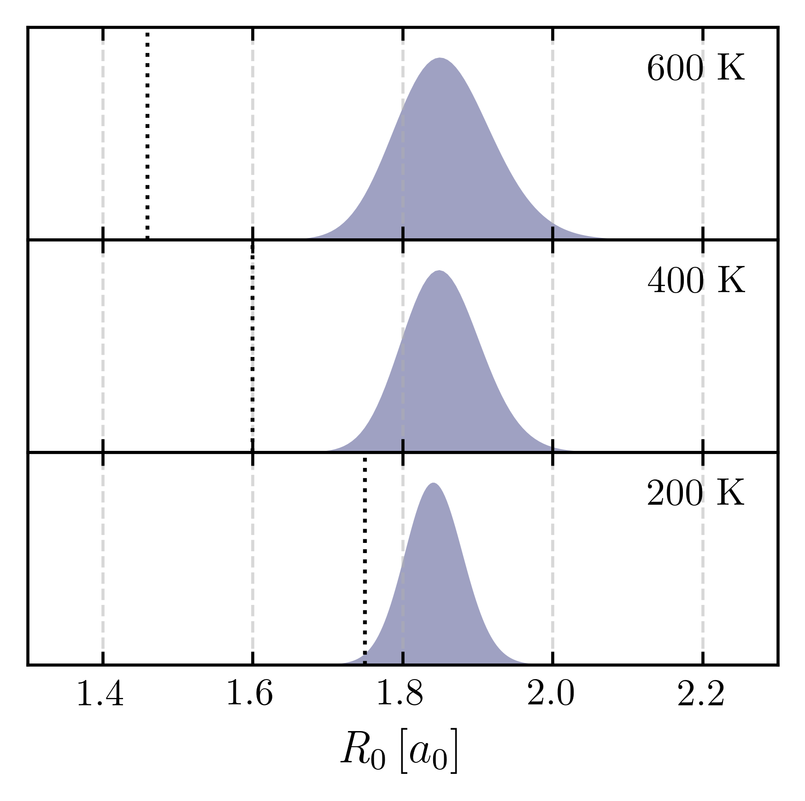
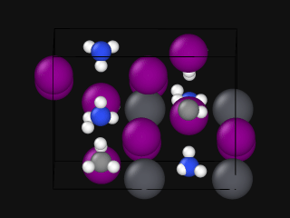
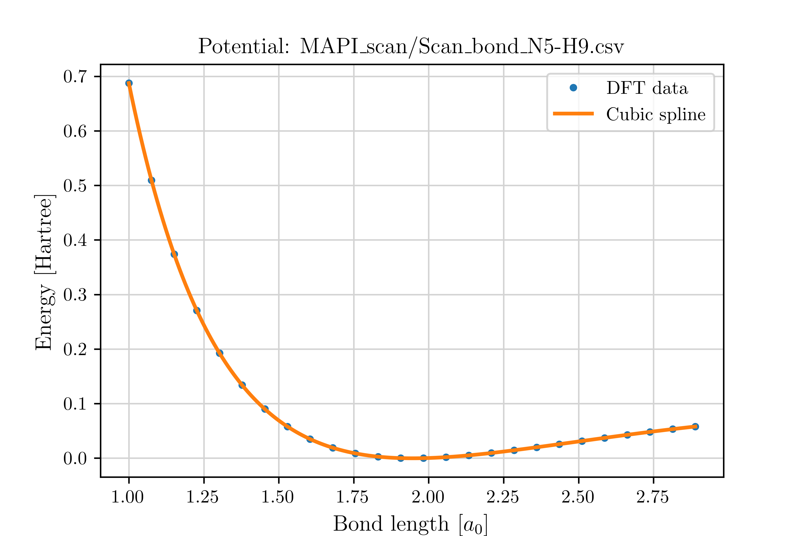

A Practical Recipe for Choosing the Elevated Temperature :math:`T_e` for :math:`T_e`\–CMD
================================================================================================

contributed by Jorge Castro. 

---

Overview
--------

The following analysis is intended to be **descriptive** rather than strictly procedural.  
As long as your workflow remains **consistent with the reasoning and methodology** described below,  
your results should be fully reliable and comparable to those obtained in our study.

To make this process more accessible, we provide a **Python script** that automates all the core steps 
of the elevated temperature (:math:`T_e`) analysis.  
You can either use this implementation **directly** or adapt it as a **template** to build your own 
analysis workflow.

.. raw:: html

   <a href="../_static/get_Te_curve.py" download style="
       display:inline-block;
       margin-top:6px;
       padding:8px 16px;
       background-color:#004080;
       color:white;
       border-radius:6px;
       text-decoration:none;
       font-weight:500;">
       Download get_Te_curve.py
   </a>

---

Introduction
---------------

`Trenins and Althorpe <https://doi.org/10.1063/1.5038616>`_ introduced the concept of a **crossover radius**
:math:`r_{\text{cross}}` — the position along a curvilinear potential below which *artificial instantons* may appear,
leading to the **curvature problem** in centroid molecular dynamics (CMD).

At finite temperature, the centroid fluctuates around its equilibrium position :math:`r_{eq}` according to a thermal
distribution, often approximated by a Gaussian with standard deviation :math:`\sigma(T)` that decreases as temperature increases.

The goal is to identify a temperature range where :math:`r_{\text{cross}}` lies safely outside the tail of this distribution.
In this regime, artificial instantons are avoided and CMD remains reliable. This idea is illustrated in Figure 1.

   **Figure 1:** CMD quantum Boltzmann distributions of the centroid along the coordinate 
   :math:`R_0 = \sqrt{X_0^{2} + Y_0^{2}}` for a two-dimensional “champagne-bottle” potential 
   representing a vibrating and rotating O–H bond.  
   At high temperature (600 K), the centroid distribution (shaded area) remains well separated 
   from :math:`r_{\text{cross}}` (dotted line), so the curvature problem is negligible.  
   At intermediate temperature (400 K), the tail approaches :math:`r_{\text{cross}}`, and at 
   low temperature (200 K), they overlap substantially—marking the onset of artificial instantons.

The procedure outlined in our recent `work <https://doi.org/10.48550/arXiv.2508.16246>`_
provides a practical way to determine such ranges for the elevated temperature :math:`T_e`,
using only the one-dimensional potential energy profile along the vibrational coordinate of interest.

Preparation Stage
-------------------

Before determining the elevated temperature :math:`T_e`, ensure that a **suitable potential energy surface (PES)**
is available for the vibrational coordinate of interest.  
All examples below use **methylammonium lead iodide (MAPI)**.

1. Select Candidate Bonds
^^^^^^^^^^^^^^^^^^^^^^^^^^^^^^

Identify bonds likely to **couple with curvilinear or rotational motion** — these are the most susceptible to the curvature problem.

Typical examples include **O–H**, **N–H**, **C–H**, or **C–C** stretches.

In **MAPI**, both **N–H** and **C–H** stretching vibrations can couple to rotational and librational modes of the molecular cation.
These bonds are therefore chosen as target coordinates for generating one-dimensional potential energy scans.

2. Generate Displaced Geometries
^^^^^^^^^^^^^^^^^^^^^^^^^^^^^^^^^

For each selected bond:

* Displace the lighter atom along the bond axis by a chosen step size (:math:`\pm \Delta r`).
* Generate geometries covering the specified displacement range.

The provided Python script automatically analyzes the input geometry, detects the specified bonds using a customizable
**interatomic distance threshold** (default: 1.2 Å), and creates a dedicated directory for each identified bond.

Each directory contains an ``.xyz`` trajectory file with all displaced configurations, allowing you to visualize
the motion and select representative scans for the :math:`T_e` analysis.

Example command:

.. code-block:: bash

   python get_Te_curve.py \
       --generate \
       --bonds CH NH        # Bonds of interest \
       --bond-threshold 1.2 # Angstrom \
       --geom geometry.in   # Equilibrium structure \
       --range -0.5 0.5     # Displacement range \
       --npoints 26 \
       --traj               # Generate xyz trajectories \
       --output MAPI_scans  # Output directory

3. Compute Potential Energy Scans
^^^^^^^^^^^^^^^^^^^^^^^^^^^^^^^^^

Use your preferred **electronic structure method** (e.g., DFT) to compute total energies for all displaced geometries.
This produces the one-dimensional potential energy curves :math:`V(r)` needed for the :math:`T_e` analysis.

For **MAPI**, the selected bonds are:

- N5–H9  
- C1–H21  
- C1–H26  
- C1–H29

   

   
Once calculations are complete, collect results and automatically generate the required ``.csv`` files using:

.. code-block:: bash

   python get_Te_curve.py \
       --collect \
       --input Scan_bond_N5-H9  # Directory with single-point energy results \
       --prefix mapi_sp         # Prefix of the output files: mapi_sp_$Scan_Step.out \
       --range -0.5 0.5         # Angstrom \
       --npoints 26

This yields ``Scan_bond_N5-H9.csv``.

:math:`T_e` Calculation Overview
--------------------------------

4. Determine the Crossover Radius and Mapping Functions
^^^^^^^^^^^^^^^^^^^^^^^^^^^^^^^^^^^^^^^^^^^^^^^^^^^^^^^

From the potential energy curve :math:`V(r)`, compute the **crossover radius** :math:`r_c(T)` and its inverse mapping
:math:`T(r_c)` by solving Eq. (10) numerically.

   

5. Compute the Centroid Width
^^^^^^^^^^^^^^^^^^^^^^^^^^^^^

From the same potential, estimate the **spread of centroid positions** using Eq. (12).
This gives the temperature-dependent width :math:`\sigma(T)` of the centroid distribution.

6. Establish the Temperature Bounds
^^^^^^^^^^^^^^^^^^^^^^^^^^^^^^^^^^^

Determine the lower and upper temperature limits, :math:`T_{\text{low}}` and :math:`T_{\text{high}}`,
using Eqs. (13a) and (13b).  
These define the range where the curvature problem is avoided without breaking the elevated-temperature approximation.

7. Construct the :math:`T_e(T_{\text{phys}})` Curve
^^^^^^^^^^^^^^^^^^^^^^^^^^^^^^^^^^^^^^^^^^^^^^^^^^^^^^^

For each physical temperature :math:`T_{\text{phys}}`:

* If :math:`T_{\text{phys}} < T_{\text{high}}`: Compute Eq.14 and assign:
  :math:`T_e` as the largest of :math:`T_{\text{candidate}}` and :math:`T_{\text{low}}`.
* If :math:`T_{\text{phys}} > T_{\text{high}}`: set :math:`T_e = T_{\text{phys}}`.

This produces the final :math:`T_e` vs. :math:`T_{\text{phys}}` mapping.

.. figure:: figures/Te_curve.png
   :width: 500px
   

Steps 4–7 can be executed automatically for all potential-energy scans using the command below:

.. code-block:: bash

   python get_Te_curve.py \
       --te \
       --potentials path-to/Scan_bond_N5-H9.csv   # 1D potential files \
                  path-to/Scan_bond_C1-H21.csv \
                  path-to/Scan_bond_C1-H26.csv \
                  path-to/Scan_bond_C1-H29.csv \
       --req-list 1.029 1.085 1.085 1.085         # Equilibrium bond lengths (Å) \
       --mred-list 1714.61 1696.49 1696.49 1696.49 # Reduced masses \
       --output results                           # Output directory \
       --tmin 3 --tmax 1000                       # Temperature range (K) \
       --tphys 110                                # Optional: target physical temperature (K) \
       --plots                                    # Optional: display intermediate plots (4–6)

The command above yields a combined plot with :math:`T_{e}(T_{\text{phys}})` 
for all analyzed bonds.

8. Select the System-Wide Elevated Temperature
^^^^^^^^^^^^^^^^^^^^^^^^^^^^^^^^^^^^^^^^^^^^^^^

If multiple bonds were analyzed, choose the **highest** :math:`T_e` among all candidates.
This ensures a single elevated temperature suitable for the entire system.