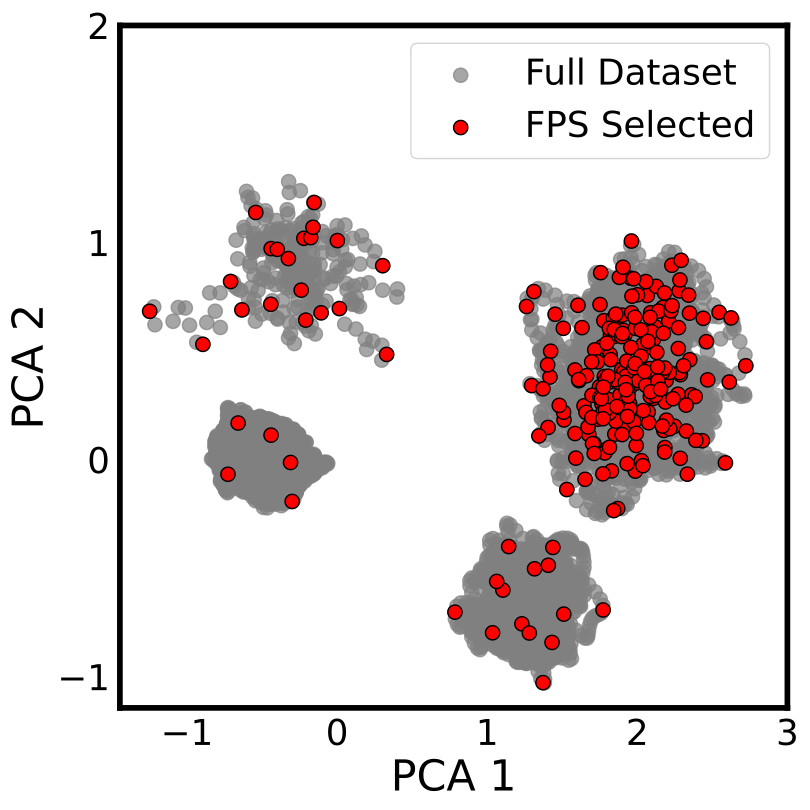

############################################
    Farthest Point Sampling (FPS)
############################################

| Farthest Point Sampling determine a data subset that maximizes the variance in the distribution of the features or samples.

| In FPS, the selection of the first point is made at random or by a separate metric. Each subsequent selection is made to maximize the Haussdorf distance, i.e. the minimum distance between a point and all previous selections. 

.. math::
    *_{m+1} = argmax_{j} \left\{ min_{i \in *_{m}} [d(i, j)] \right\}

| where ∗m contains the previous selections, ∗m+1 is the next selected sample or feature, and d(i, j) indicates the distance between the ith and jth column or row.

| For machine learning potentials, FPS can be used to select the initial training set from a pool of data points. Also, FPS can be used for feature selection in case of Behler-Parrinello based machine learning potentials.

For more information, see the following references:
`Feature and Sample selection methods <https://scikit-matter.readthedocs.io/en/v0.1.4/selection.html#fps-api>`_

.. note::
    The FPS algorithm works on atomic environments of a system. So, to perform FPS on a pool of data points, one needs to convert atomic coordinates into atomic environments e.g. SOAP, ACSF, etc.

************************************************************
      How to perfrom FPS on a pool of data points?
************************************************************

| 1. Install `librascal <https://github.com/lab-cosmo/librascal>`_ which is used to convert atomic positions into SOAP descriptors.

.. note:: 
    How to compile librascal?
    
    | 1. conda create -n rascal
    | 2. conda install python==3.9 (!! cation: do not use python version above 3.10, you wont be able to compile it because in newer versions The PyFrameObject structure members have been removed from the public C API).
    | 3. mkdir build

| 2. Install `scikit-matter <https://scikit-matter.readthedocs.io/en/v0.1.4/selection.html#fps-api>`_ which have the FPS API.

************************************************************
                Diving into the code
************************************************************

1. Reading the atomic coordinated using ASE.

.. code-block:: python
    frames = read(structure_file, index=':', format='extxyz')

2. Initilizing the SOAP hyperparameters.

.. code-block:: python
    SOAP_HYPERS = {
        "interaction_cutoff": 3.5,
        "max_radial": 6,
        "max_angular": 6,
        "gaussian_sigma_constant": 0.4,
        "cutoff_smooth_width": 0.5,
        "gaussian_sigma_type": "Constant",
    }
3. Transforming atomic coordinates into SOAP descriptors.

.. code-block:: python
     x = soap.transform(frame).get_features(soap).mean(axis=0)

4. Perform FPS on the samples.

.. code-block:: python
    struct_idx = FPS(n_to_select=n_FPS, initialize = 123).fit(X.T).selected_idx_

5. Visualize the FPS selected samples by performing PCA on SOAP descriptors. (Here one can use any dimensionality reduction technique)

.. code-block:: python
    X_full = StandardFlexibleScaler(column_wise=False).fit_transform(X_full)
    T = PCA(n_components=2).fit_transform(X_full)

