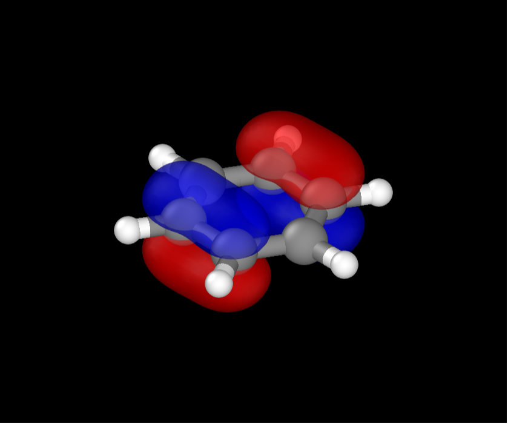
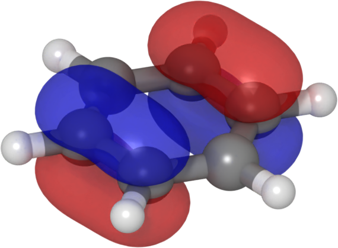

##############################
Visualizing Molecular Orbitals
##############################

Contributed by George Trenins

This tutorial explains how to visualize molecular orbitals using `FHI-aims`_ to generate the data and `OVITO`_ to render the molecules and the isosurfaces.

********************************
Electronic structure calculation
********************************

In order to output the probability amplitude/density for the correct molecular orbitals, we must first determine their indices. For this tutorial we will consider benzene as an example. Below is the equilibrium geometry, courtesy of Hannah Bertschi, optimized using FHI-aims with the PZ LDA functional and tight defaults. Click on the title to unroll and hover in the top-right corner of the text field to access to copy button.

.. raw:: html

    

.. raw:: html

    

    
geometry.in

    

.. code-block::

    atom      -1.20547565     -0.68410539      0.00000919 C
    atom      -1.19519424      0.70194528      0.00001938 C
    atom      -0.01026432     -1.38603582     -0.00000186 C
    atom       0.01029765      1.38606915      0.00001853 C
    atom       1.19522757     -0.70191195     -0.00000272 C
    atom       1.20550898      0.68413872      0.00000748 C
    atom      -2.15677132     -1.22396374      0.00000987 H
    atom      -2.13837649      1.25585678      0.00002809 H
    atom      -0.01837692     -2.47981099     -0.00000989 H
    atom       0.01841025      2.47984432      0.00002657 H
    atom       2.13840983     -1.25582344     -0.00001144 H
    atom       2.15680466      1.22399707      0.00000680 H

.. raw:: html

    

    

First pass
==========

The first step is to run a single-point calculation that will allow us to determine the indices of our orbitals of interest. Remember to save the density-matrix restart files, so that you do not have to run the whole calculation from scratch on the second pass.

.. raw:: html

    

    
control.in

    

.. code-block::

    xc              pz-lda
    spin            none
    relativistic    none
    charge          0.0
    elsi_restart    write scf_converged

    # grids and basis functions 
    ...

.. raw:: html

    

    

Having run the calculation, examine the list of orbital energies after the final occurrence of  `Writing Kohn-Sham eigenvalues` in the output file (the comments were added by me).

.. code-block::

  Writing Kohn-Sham eigenvalues.

  State    Occupation    Eigenvalue [Ha]    Eigenvalue [eV]
      1       2.00000          -9.790481         -266.41254
    ...
     20       2.00000          -0.241127           -6.56141 
     21       2.00000          -0.241127           -6.56139    # HOMO 
     22       0.00000          -0.050392           -1.37123    # LUMO
     23       0.00000          -0.050392           -1.37123
    ...

In this instance, we will be visualizing the degenerate occupied orbitals 20 and 21 (HOMO-1 and HOMO, respectively). 

Second pass
===========

Modify you control file to read

.. code-block::

    xc                 pz-lda
    spin               none
    relativistic       none
    charge             0.0
    elsi_restart       read
    cube_content_unit  bohr
    output             cube eigenstate 20
    output             cube eigenstate 21

`FHI-aims`_ will choose sensible defaults for the three-dimensional grid on which to output the probability amplitude data. If you want to customize this, check the manual for the keywords :code:`cube origin`, :code:`cube edge`, and :code:`cube edge_density`. If you want to output the probability density instead, change the type of the output from :code:`eigenstate` to :code:`eigenstate_density`.

.. hint::

    If all you are interested in are the HOMO and/or LUMO of your system, you may specify this in your control file, e.g. :code:`output cube eigenstate homo`. In this case you do not need to perform a two-pass calculation.

After running `FHI-aims`_ with the modified control file, you working directory will contain the following output files:

.. code-block::

    D_spin_01_kpt_000001.csc                # restart file from the first pass
    cube_001_eigenstate_00020_spin_1.cube   
    cube_002_eigenstate_00021_spin_1.cube   

The cube files follow an intuitive naming convention and can be visualized using `VMD`_. However, you may achieve better results using `OVITO`_.

******************
Data visualization
******************

A major advantage to `OVITO`_ is that it allows you to write visualization scripts in python. To install the python interpreter, follow the installation instructions `here <https://www.ovito.org/manual/python/introduction/installation.html>`_. I recommend using a virtual environment and including :code:`jupyter` in the installation. If you are producing a one-off image or want to establish sensible visualization settings for a sequence of frames, it is convenient to perform the initial manipulations in a notebook.

Loading the data
================

The syntax for loading a cube file runs along the lines

.. code-block:: python

    from ovito.io import import_file
    from ovito.pipeline import Pipeline
    from ovito.data import VoxelGrid

    pipeline : Pipeline = import_file(
        'cube_002_eigenstate_00021_spin_1.cube',  # name of data file
        input_format="gaussian/cube",             # optional, should be able to deduce by itself
        grid_type=VoxelGrid.GridType.PointData,   # "positioning" of data in the voxels
        generate_bonds=True                       # why not?
    )

The data is loaded into a `Pipeline <https://www.ovito.org/docs/current/python/modules/ovito_pipeline.html#ovito.pipeline.Pipeline>`_, to which one later appends a series of post-processing operations, called `Modifiers`. Click `here <https://www.ovito.org/docs/current/reference/file_formats/input/gaussian_cube.html#file-formats-input-cube>`_ for further information on the keyword arguments.

.. _isosurface-label:

Creating the isosurface
=======================

Calculating an isosurface is an example of an operation performed by a `Modifier <https://www.ovito.org/docs/current/python/introduction/pipelines.html#modifiers-overview>`_. You can access a complete `list <https://www.ovito.org/docs/current/python/modules/ovito_modifiers.html#module-ovito.modifiers>`_ of all modifiers, but for our present purposes we are only interested in the aptly named `CreateIsosurfaceModifier <https://www.ovito.org/docs/current/python/modules/ovito_modifiers.html#ovito.modifiers.CreateIsosurfaceModifier>`_.

.. literalinclude:: files/isotools.py
   :language: python

You shouldn't need to modify the arguments of :code:`CreateIsosurfaceModifier` when loading FHI-aims orbital cube files. The visualization settings are controlled by the `SurfaceMeshVis <https://www.ovito.org/docs/current/python/modules/ovito_vis.html#ovito.vis.SurfaceMeshVis>`_ *visualization element*, which can be created first and passed as an argument to the :code:`__init__()` of :code:`CreateIsosurfaceModifier`, as in the example above. Alternatively, it can be modified once the modifier has already been created, to the exact same effect:

.. code-block:: python

    isosurface = CreateIsosurfaceModifier(
        operate_on = "voxels:imported",
        isolevel = isolevel,
        property = 'Property')
    isosurface.vis.color_mapping_mode = SurfaceMeshVis.ColorMappingMode.Uniform
    isosurface.vis.surface_color = color
    isosurface.vis.surface_transparency = alpha

In our example, we append two modifiers, to visualize the positive and negative lobes of the HOMO:

.. code-block:: python

    pipeline = append_isosurface(pipeline, color=(1.0, 0.0, 0.0), isolevel=0.05, alpha=0.5)
    pipeline = append_isosurface(pipeline, color=(0.0, 0.0, 1.0), isolevel=-0.05, alpha=0.5)

Modifying molecule appearance
=============================

At this stage, on further post-processing need be done on the date. All that remains are some visualization settings to modify the default appearance of the simulation cell, atoms, and bonds (if any). We may, therefore, execute the pipeline:

.. code-block:: python

    from ovito.data import DataCollection
    data: DataCollection = pipeline.compute()

.. _cell-label:

Simulation cell
---------------

The resulting :code:`DataCollection` has a list of properties that describe aspects of your system, such as the `simulation cell <https://www.ovito.org/docs/current/python/modules/ovito_data.html#ovito.data.DataCollection.cell>`_. These, properties, in turn, each have a *visualization element* attached to them that controls their appearance.

.. code-block:: python

    from ovito.data import SimulationCell
    from ovito.vis import SimulationCellVis
    cell: SimulationCell = data.cell
    vis: SimulationCellVis = cell.vis
    vis.rendering_color: tuple[float,float,float] = (0.0, 0.0, 0.0)
    vis.line_width: float = 0.1     # in simulation units of length
    vis.enabled: bool = False       # turn of the simulation cell completely

You can, of course, modify the visualization setting directly, as in 

.. code-block:: python

    data.cell.vis.render_cell = False

.. _atom-label:

Atoms
-----

The appearance of the atoms is controlled via the `particles <https://www.ovito.org/docs/current/python/modules/ovito_data.html#ovito.data.DataCollection.particles>`_ property.

.. code-block:: python

    from ovito.data import Particles
    from ovito.vis import ParticlesVis
    particles: Particles = data.particles
    vis: ParticlesVis = particles.vis
    # scale the particle radius for all species by the same factor
    vis.scaling: float = 2.0
    
Modifying particle colour or size by index/element is more involved and is not considered in this tutorial (refer to the `documentation <https://www.ovito.org/docs/current/python/modules/ovito_data.html#ovito.data.Particles>`_ for more info).

.. _bond-label:

Bonds
-----

Chemical bonds are stored as a sub-object of the :code:`particles`. Modifying their appearance follows the patter familiar to you by now:

.. code-block:: python

    from ovito.data import Bonds
    from ovito.vis import BondsVis
    bonds: Bonds = data.particles.bonds
    vis: BondsVis = bonds.vis
    # Set the width of all the bonds (in atomic units)
    vis.width: float = 0.4 

.. _OVITO: https://www.ovito.org/
.. _FHI-aims: https://fhi-aims.org/
.. _VMD: https://www.ks.uiuc.edu/Research/vmd/

Making the 3D image
===================

Now that you've chosen the visualization setting for the different plot elements (:ref:`isosurfaces <isosurface-label>`, :ref:`simulation cell <cell-label>`, :ref:`atoms <atom-label>`, and :ref:`bonds <bond-label>`), we set the scene in three-dimensional space and render it.

Positioning the camera
----------------------

First, we create a `Viewport <https://www.ovito.org/docs/current/python/modules/ovito_vis.html#ovito.vis.Viewport>`_, which you can think of as a window opening up onto the three-dimensional scene.

.. code-block:: python 

    from ovito.vis import Viewport
    # Insert your pipeline into the three-dimensional scene
    pipeline.add_to_scene()
    # Open a window on the scene
    vp: Viewport = Viewport(
        type=Viewport.Type.Ortho,  # can change to Perspective
        camera_pos=3*(1,),         # position of the camera in 3D space
        camera_dir=3*(-1,),        # direction in which the camera is pointing
        fov=1.0                    # field of view of the camera
    )
    # Set the horizontal and vertical dimensions of the image in pixels
    size: tuple[int,int] = (600, 500)  
    # modify camera_pos and fov to get a reasonably zoomed in view without cropping
    vp.zoom_all(size=size)

It is at this stage that working in a Jupyter notebook becomes especially helpful, as you can create an interactive widget that allows you to modify the camera position:

.. code-block:: python

    import ipywidgets
    from IPython.display import display
    from ovito.gui import create_ipywidget

    # width of the widget window in pixels
    ww: int = 600
    # keep the aspect ratio of the widget window the same as the output image
    aspect: float = size[0]/size[1]
    widget = create_ipywidget(vp, layout=ipywidgets.Layout(
        width=f'{ww}px', height=f'{int(ww/aspect)}px'))
    display(widget)

You can rotate the molecule by left-clicking and dragging. To translate the molecule, hold down the :kbd:`Shift` key as you left-click and drag. To zoom in and out, use the :kbd:`Scroll` wheel. You can view the updated camera settings (e.g., for later use in a script) by executing

.. code-block:: python

    print(
        f"{vp.camera_dir = }\n"
        f"{vp.camera_pos = }\n"
        f"{vp.fov = }")

Rendering the image
-------------------

Once you are quite satisfied with the camera angle, you can export the image by running

.. code-block:: python

    from ovito.vis import OpenGLRenderer
    output_image_name: str = f'benzene_homo.png'
    vp.render_image(
        size=size, 
        alpha=True,
        crop=True,
        filename=output_image_name, 
        renderer=OpenGLRenderer())

The defaults settings from the `OpenGLRenderer <https://www.ovito.org/docs/current/python/modules/ovito_vis.html#ovito.vis.OpenGLRenderer>`_ do the job nicely, but for a highly customizable fancy alternative check out the `OSPRayRenderer <https://www.ovito.org/docs/current/python/modules/ovito_vis.html#ovito.vis.OSPRayRenderer>`_, which was used to produce the image below.

Tidying up
-----------

If you are processing a sequence of frames in a for-loop, you may find it helpful to remove a pipeline from the scene:

.. code-block:: python

    # Remove pipeline from the scene after rendering
    pipeline.remove_from_scene()
