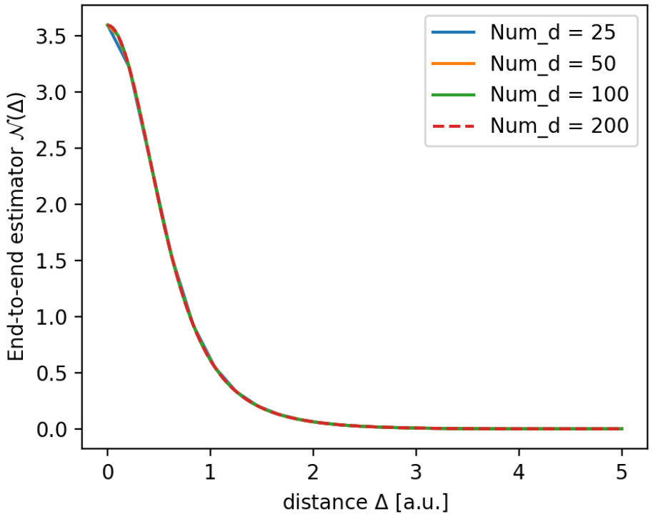
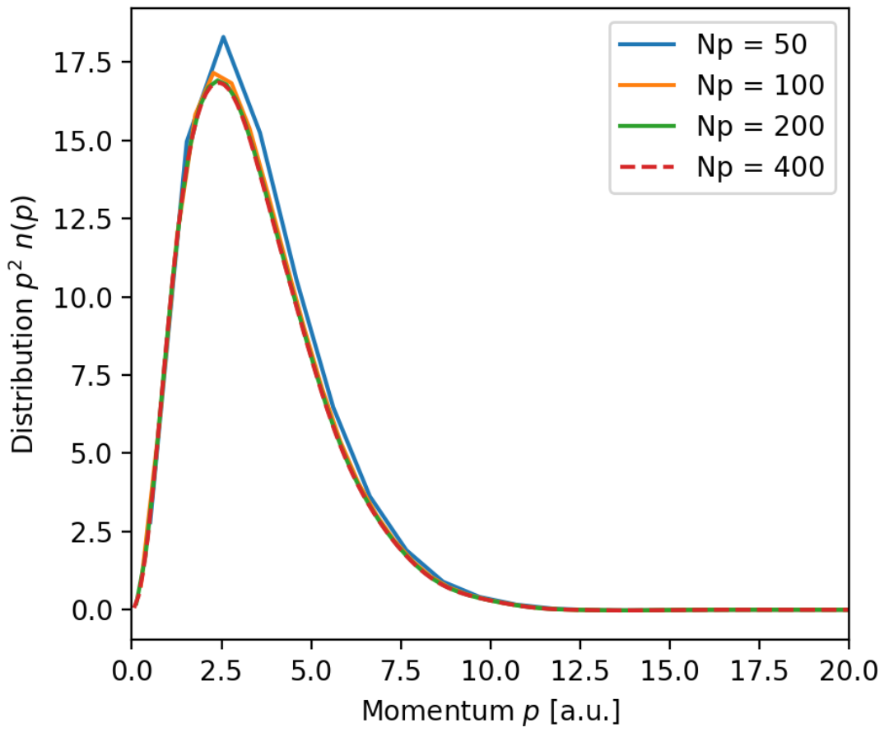

###########################################
Momentum distributions from open path PIMD
###########################################

Contributed by Hannah Bertschi

This tutorial shows how to set up an open path PIMD simulation in i-pi for the example of the water dimer. Furthermore, it describes how the output from i-pi can be used and processed to get the radial momentum distribution. Potential problems and how to test the results are provided as well. 

**********
Background
**********

This section provides very minimal information on what equations are necessary to calculate the momentum distribution of an atom in a multi-atom molecule in three dimensions. For derivations please refer to [Pro]_ its supporting information also contain important information.

The momentum distribution of atom :math:`k` can be represented as a Fourier transform of the off-diagonal position matrix element of the density matrix :math:`e^{- \beta \hat{H}}/Z` 

.. math::
    n_k(\boldsymbol{p}) = \frac{1}{(2 \pi \hbar)^3 Z} \int \ d\boldsymbol{\Delta} \  e^{\frac{i}{\hbar}\boldsymbol{p}\cdot \boldsymbol{\Delta}} \int d\{\boldsymbol{q}\} \bra{\boldsymbol{q}_1, \ldots \boldsymbol{q}_N} \ e^{- \beta \hat{H}} \ket{\boldsymbol{q}_1, \ldots \boldsymbol{q}_k + \boldsymbol{\Delta}, \ldots  \boldsymbol{q}_N}

The subscripts refer to the :math:`N` atoms and :math:`\boldsymbol{q}` is their three dimensional position vector. The matrix element is off-diagonal, as there is a shift for atom :math:`k` of :math:`\boldsymbol{\Delta}`. The position matrix element can be sampled by running path-integral molecular dynamics, where on atom :math:`k` no spring connects the first and last bead. 

In the end we want the radial momentum distribution, since during the simulation the molecule either way rotates. After averaging over the angles we get 

.. math::
   :label: n(p)

    n_k(p) = 4 \pi \int d\Delta \ \mathcal{N}_k(\Delta) \ \Delta^2 \frac{\hbar}{p \Delta} \sin \left( \frac{p \Delta}{\hbar}\right)

where :math:`\mathcal{N}_k(\Delta)` can be sampled by running an open path PIMD simulation. The distance of the first and last bead :math:`P` of atom :math:`k` given by :math:`|\boldsymbol{q}_k^{(P)} - \boldsymbol{q}_k^{(1)}|` has to be calculated for each sample and then averaged via the following function

.. math::
   :label: estimator

    \mathcal{N}_k(\Delta) = \biggl \langle \frac{(2 \pi \sigma_P^2)^{-1/2}}{\Delta \ |\boldsymbol{q}_k^{(P)} - \boldsymbol{q}_k^{(1)}|} \left[  e^{-\frac{1}{2 \sigma_P^2} (\Delta - |\boldsymbol{q}_k^{(P)} - \boldsymbol{q}_k^{(1)}|)^2} - e^{-\frac{1}{2 \sigma_P^2} (\Delta + |\boldsymbol{q}_k^{(P)} - \boldsymbol{q}_k^{(1)}|)^2}\right] \biggr \rangle.

Here we use :math:`\sigma_P^2 = \hbar^2 \beta/P m_k` with the inverse temperature :math:`\beta`, the amount of beads :math:`P` and the mass of the atom :math:`m_k`.

************
i-pi inputs
************

Similar to standard PIMD we run a molecular dynamics simulation in the NVT ensemble with multiple beads. Most of the input keywords stay the same as compared to the standard PIMD. We will go here through an example xml input file and highlight what input is special for the open path simulations. 

Some things to think about before/ when setting up the input file are (*italic* for what is shown in this example):

- What is the temperature of interest? *60 K* 
- How many beads are necessary for the chosen temperature and system? *64 beads*
- What potential to use? *connection to MBX forcefield via unix socket*
- Is there already a PIMD simulation from which to restart? *use RESTART-64 for initialization*
- For which atom do I want to calculate the momentum distribution, i.e. which atom(s) need an open path?
  *one open path on atom 1 (hydrogen)*
- What thermostat and related parameters to use?
- ...

.. note::
   The counting of indices in i-pi starts from zero. This is relevant for specifying the atom with an open path and its first and last beads.

Lets first look at what output to request:

.. code-block:: xml

  <simulation verbosity='low'>
    <output prefix="simulation">
      <properties stride='40' filename='out'>
            [ step, time{picosecond}, conserved, temperature{kelvin}, kinetic_cv, potential, kinetic_cv(2), kinetic_cv(1) ]
      </properties>
      <properties stride='40' filename='H.q'> [ atom_x_path(1)] </properties>
      <trajectory bead='-16' format='xyz' filename='pos' stride='40'> positions </trajectory>
      <trajectory bead='63' format='xyz' filename='posn' stride='40'> positions </trajectory>
      <checkpoint filename="chk" stride="2000" overwrite="true"/>
    </output>

The momentum distribution depends on the distance between the first and last bead of the atom with the open path. Therefore these geometries need to be ouptput. This is done in two ways here. The line ``<properties stride='40' filename='H.q'> [ atom_x_path(1)] </properties>`` outputs all the bead positions of atom 1 every 40 steps.  

Other than writing all bead positions of the atom of interest, we can also write the geometries of all atoms of some specific beads. The line ``<trajectory bead='-16' format='xyz' filename='pos' stride='40'> positions </trajectory>`` outputs every 16nth bead of each atom, i.e. including bead 0. And the next line outputs the geometry of the last bead 63. Each bead is output in a xyz file.

Either option gives us the geometries of atom 1 for the first and last bead. These we will need to process in the following section to get the momentum distributions.

Next in the xml file follows some generic information on the total steps and connection to a driver.

.. code-block:: xml

  <total_steps>100000</total_steps>
    <prng>
      <seed>3348</seed>
    </prng>
    <ffsocket mode='unix' name='driver'>
      <address>mbx</address>
    </ffsocket>

Here we tell i-pi to use 64 beads and read for initialization a restart file, which corresponds to an equilibrated ring polymer structure. The forces are just the ones from the driver.

.. code-block:: xml

  <system>
    <initialize nbeads='64'>
      <file mode='chk'> RESTART-64 </file>
    </initialize>
    <forces>
      <force forcefield='driver'/>
    </forces>

This code block specifies the open path. In this case it is on atom 1, which is a hydrgen atom.

.. code-block:: xml

  <normal_modes>
    <open_paths> [1] </open_paths>
  </normal_modes>

Lastly follows all information on the NVT ensemble. 

.. code-block:: xml

    <ensemble>
      <temperature units='kelvin'>60.0</temperature>
    </ensemble>
    <motion mode='dynamics'>
      <dynamics mode='nvt' splitting='baoab'>
        <thermostat mode='pile_l'>
          <tau units='femtosecond'> 100 </tau>
        </thermostat>
        <timestep units='femtosecond'>0.25</timestep>
      </dynamics>
    </motion>
    </system>
    </simulation>

The full input file is provided in ``docs/source/open_paths/ipi_files/config.xml``. Additionally, the xyz files for the first and last beads are in that folder as well. 

********************************
Processing the simulation output
********************************

The output geometries from the simulation are used to first calculate distance between the first and last bead (in the code referenced as ``dist_H``). Then the radial estimator in equation :eq:`estimator` has to be constructed. Below is some code on how this can be done.

.. code-block:: python

  import numpy as np

  def radial_estimator(delta, qP_q1, sigP):
      """
      Calculate the radial estimator for the end-to-end distance

      Args:
      delta (one dimensional array of floats): distances for which to 
      evaluate the estimator
      qP_q1 (float or one dimensional array): sampled distances
      of the last and first bead
      sigP (float): standard deviation of the Gaussians, 
      sigP = sqrt(hbar^2 beta / (P m))

      Returns:
      N (one dimensional array): radial estimator as a 
      function of delta (same length), is averaged over all qP_q1
      distances
      """
      D, q = np.meshgrid(np.asarray(delta), np.asarray(qP_q1))
      #delta in rows and qP_q1 in columns
      a = (2 * np.pi * sigP**2)**(-0.5) / (D * q)
      e1 = np.exp(-((D - q)**2)/(2 * sigP**2))
      e2 = np.exp(-((D + q)**2)/(2 * sigP**2))
      X = a * (e1 - e2)
      N = np.mean(X, axis=0) # average over qP_q1 values in columns
      return N

On a range of 0.001 to 5 for the ``delta`` variable I calculate the radial estimator for differing amounts of points ``Num_d``. 

.. code-block:: python

   Num_d = [25, 50, 100, 200]
   ds = [np.linspace(0.001, 5, Nd) for Nd in Num_d]
   N_s = [radial_estimator(delta=d, qP_q1=dist_H, sigP=sigH) for d in ds]

The resulting functions looks like this.

The radial momentum distribution is the given by the equation :eq:`n(p)`. A function that calculates this is:

.. code-block:: python

   def radial_momentum(delta, N, p, hbar=1):
       """
       Calculate the spherically averaged momentum distribution

       Args:
       delta (float or one dimensional array): distances for which 
       the end-to-end distance is evaluated
       N (one dimensional array): radial end-to-end estimator, same
       length as delta
       p (float or one dimensional array): momenta for which to calculate
       the distribution
       """
       P, D = np.meshgrid(np.asarray(p), np.asarray(delta))
       P, Nm = np.meshgrid(np.asarray(p), np.asarray(N))
       # p in rows and delta dependence in columns
       integrand = Nm * D**2 * hbar / (P * D) * np.sin(P * D / hbar)
       del_D = integral_del(D)
       av_int = integral_av(integrand)
       I = integrate(del_D, av_int)
       p_new = integral_av(p)
       n = 4 * np.pi * I
       return p_new, n

All code is provided in ``docs/source/open_paths/momentum_distribution.py`` file, also the integration fucntions used in the previous code. 

Trying different momentum grids and using the delta grid with 100 points

.. code-block:: python

   Num_p = [50, 100, 200, 400]
   ps = [np.linspace(0.001, 50, N) for N in Num_p]
   n_Hs = [radial_momentum(delta=ds[2], N=N_H, p=p) for p in ps]

gives plots like this

.. note::
   The momentum distributions coming out of these formulas are not normalized. One has to normalize :math:`p^2 \ n(p)` by its integral.

Things to keep in mind or make tests based on:

- Test if the distributions are converged with respect to the simulation time
- If there are multiple atoms of the same type (but different symmetry) check whether the open path is on each one equally is much
- From :math:`p^2 \ n(p)` you can calculate the kinetic energy, which can be compared to standard PIMD centroid-virial estimator
- A harmonic analysis also allows calculation of the momentum distribution to compare to  

**References**

.. [Pro] V. Kapil, A. Cuzzocrea, and M. Ceriotti. *Anisotropy of the Proton Momentum Distribution in Water* J. Phys. Chem. B **122** 6048-6054 (2018).

