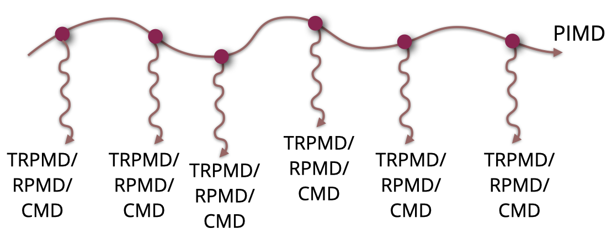

###############################
RPMD, TRPMD and CMD Simulations
###############################

This is a short introduction on how to setup, perform and check consistency of RPMD, TRPMD and CMD simulations.
Knowledge about PIMD techniques, in general, is assumed. If you have none, make sure you at least do
the online course available under `this MOOC link`_. In addition, we will be basing simulations on the `i-PI code`_
syntax. We also assume that you know how to run i-PI. If you do not, check the documentation `getting started`_ and
`simple tutorial`_ parts of the code documentation.

************************
Equilibrating the system
************************

Every time you will perform these simulations, you need to first have a set of pre-equilibrated starting points.
These can be done in several different ways. Irrespective of the system or potential you are running with,
this will involve a temperature equilibration or a temperature and pressure equilibration with path-integral MD.

In i-PI, useful input code block examples are for performing these equilibrations are

.. code-block:: xml

  <motion mode='dynamics'>
    <dynamics mode='nvt'>
      <timestep units='femtosecond'> 0.25 </timestep>
      <thermostat mode='pile_g'>
        <tau units='femtosecond'> 20 </tau>
      </thermostat>
    </dynamics>
  </motion>

.. code-block:: xml

    <motion mode='dynamics'>
      <dynamics mode='nvt'>
        <timestep units='femtosecond'> 0.25 </timestep>
        <thermostat mode='pile_l'>
          <tau units='femtosecond'> 20 </tau>
        </thermostat>
      </dynamics>
    </motion>

.. code-block:: xml

      <motion mode='dynamics'>
      <dynamics mode='npt'>
         <barostat mode='isotropic'>
           <tau units='femtosecond'> 200</tau>
           <thermostat mode='langevin'>
             <tau units='femtosecond'> 100 </tau>
           </thermostat>
           <h0> [ 25.6156, 0, 0, 0, 29.5783, 0, 0, 0, 27.8867 ]</h0>
        </barostat>
        <thermostat mode='pile_l'>
          <tau units='femtosecond'> 20 </tau>
          <pile_lambda> 0.2 </pile_lambda>
        </thermostat>
        <timestep units='femtosecond'> 0.25 </timestep>
      </dynamics>
      </motion>

Remember that the time-step has to be adjusted according to your system. The :code:`tau` parameters of the thermostats as well.
If you are in doubt, we have another page here that tells you more about this parameter. In the snapshots above, we are assuming
that the simulations are run with the appropriate number of beads :code:`nbeads` for your system. Remember that :code:`nbeads` is
a convergence parameter that depends on your system, the temperature and pressure you are simulating.

When running these simulations, make sure you also add to your input file a line similar to this

.. code-block:: xml

    <checkpoint stride='8000'/>

which will print a checkpoint file every 4000 steps. If the time step is indeed 0.25 fs, that means that it will print
a checkpoint file every 2 ps. The important point for the frequency of outputs is that your system has had time to decorrelate
in-between each checkpoint file. How fast your particular system takes to decorrelate will depend on the system, the temperature,
and the thermostat/barostat. You either have a good idea about this time scale from experience, or you need to calculate it from
autocorrelation functions of the Hamiltonian (or the kinetic or potential energy). How to do this neatly is also explained in another
chapter.

***************************************
Starting the RPMD/TRPMD/CMD simulations
***************************************

Normally, the workflow is such that one starts several RPMD/TRPMD/CMD simulations from the decorrelated checkpoints generated above.
That is achieved through a modification of the :code:`<initialize>` block in the i-PI input file, which is defined in the :code:`<system>` block.
An example is given below.

.. code-block:: xml

    <initialize nbeads='16'>
        <file mode='chk'> nameofcheckpoint.chk </file>
        <velocities mode='thermal' units='kelvin'> 300 </velocities>
    </initialize>

You could also omit the :code:`<velocities>` block, but resampling them does not hurt and can increase statistical significance.
If maintaining the :code:`<velocities>`, it is always a good idea to make sure that the random number generator starts from different
seeds in every simulation you do. This is ensured by the following tag, in the main :code:`<simulation>` block

.. code-block:: xml

   <prng>
      <seed>32415</seed>
   </prng>

where you have to change the seed for a different integer for every run. Note that the default behaviour of i-PI (as of v.3.0),
if you do not set this block, the default for the seed is always `12345`, so every run will start from the same seed. That
behaviour is bad for statistical convergence.

At this point, it is nice to write a bash (or any other language) script that can automatically assign the name of the checkpoint
file and different random seeds to the input of each simulation that you will run. How such an automated script looks like strongly
depends on your directory structure and type of simulation or computing system. If you are in doubt about how to do this, contact
the colleagues and your supervisor - or even ask ChatGPT ;-)

Below, we summarize the parts of the input files that govern a CMD, RPMD or TRPMD run. Only the relevant code blocks of the input
file are shown, to highlight what controls these simulations. At the end, we also give an example of a
partially-adiabatic elevated-temperature CMD run.

RMPD
====

For the theory see reference [`JCP2005`_].

.. code-block:: xml

    <motion mode='dynamics'>
        <dynamics mode='nve'>
            <timestep units='femtosecond'> 0.25 </timestep>
        </dynamics>
    </motion>

TRMPD
=====

A :code:`tau` parameter that is very large (related to the svr thermostat attached to the centroid)
will make the thermostat on the centroid of the ring-polymer be very weak,
approaching the "no thermostat" limit. The original parametrization of TRPMD proposes a :code:`pile_lambda`, the parameter
that multiplies the frequency of respective internal mode of the ring polymer to 0.5, because that ensures
optimal damping. Slightly stronger dampings can lead to slightly sharper spectra. For the theory see reference [`JCP2014`_].

.. code-block:: xml

  <motion mode='dynamics'>
     <dynamics mode='nvt'>
        <timestep units='femtosecond'> 0.25 </timestep>
        <thermostat mode='pile_g'>
            <tau units='femtosecond'> 500 </tau>
            <pile_lambda> 0.5 </pile_lambda>
        </thermostat>
      </dynamics>
  </motion>

TRPMD+GLE
=========

The snippet below is just a parametrization downloaded from the `gle4md website`_,
by choosing the TRPMD option (parametrizations C and D lead to very similar results, typically). The number
of beads and the temperature need to be adjusted depending on your simulation wishes. This will change all numbers
in the matrix below, so one needs to use the website above to generate them again. For the theory see reference [`JCP2018`_].

.. code-block:: xml

  <motion mode='dynamics'>
     <dynamics mode='nvt'>
        <timestep units='femtosecond'> 0.25 </timestep>
         <thermostat mode='nm_gle'>
         <A shape='(8,2,2)'>
         [
         2.418884300000e-45,    0.000000000000e+0,
         0.000000000000e+0,   2.418884300000e-45,
         5.817060777361e-3,   -1.404238471655e+0,
         1.424016478298e+0,    1.686947625435e-2,
         1.074852678316e-2,   -2.594694365454e+0,
         2.631239356516e+0,    3.117072767115e-2,
         1.404362702185e-2,   -3.390131563075e+0,
         3.437879894949e+0,    4.072651836337e-2,
         1.520071235227e-2,   -3.669451961838e+0,
         3.721134383835e+0,    4.408206582158e-2,
         1.404362702185e-2,   -3.390131563075e+0,
         3.437879894949e+0,    4.072651836337e-2,
         1.074852678316e-2,   -2.594694365454e+0,
         2.631239356516e+0,    3.117072767115e-2,
         5.817060777361e-3,   -1.404238471655e+0,
         1.424016478298e+0,    1.686947625435e-2
         ]
         </A>
         </thermostat>
      </dynamics>
   </motion>

Partially-adiabatic CMD
=======================

In the :code:`<system>` part of the input, add:

.. code-block:: xml

   <normal_modes>
       <frequencies style='pa-cmd' units='inversecm'> [14000]  </frequencies>
   </normal_modes>

Note that the adiabatic separation is a convergence parameter in these simulations. For systems with
physical vibrational frequencies up to 3500 cm\ :sup:`-1`, numbers between 13000 and 24000 cm\ :sup:`-1`
can be tested. For systems with lower vibrational frequencies, this parameter can be lower.

The thermostat and time step block is also quite important. This is how it normally looks like:

.. code-block:: xml

    <motion mode='dynamics'>
       <dynamics mode='nvt'>
          <timestep units='femtosecond'> 0.05 </timestep>
          <thermostat mode='pile_g'>
              <tau units='femtosecond'> 500 </tau>
              <pile_lambda> 0.001 </pile_lambda>
          </thermostat>
        </dynamics>
    </motion>
   
Note the smaller time step because of the adiabatic separation parameter, and the :code:`pile_lambda` value that ensures
an underdamped regime for the Langevin thermostats attached to the internal modes of the ring polymer. This is important
to remove spurious effects from the Langevin thermostats attached to the internal modes. For theory check [`JCP20052`_]
and [`JCP20142`_].

.. _this MOOC link: https://courseware.epfl.ch/courses/course-v1:EPFL+X+2022/about
.. _i-PI code: https://ipi-code.org/
.. _getting started: https://docs.ipi-code.org/getting-started.html
.. _simple tutorial: https://docs.ipi-code.org/tutorials.html
.. _JCP2005: https://doi.org/10.1063/1.1850093
.. _JCP2014: https://doi.org/10.1063/1.4883861
.. _JCP2018: https://doi.org/10.1063/1.4990536
.. _gle4md website: https://gle4md.org/index.html?page=matrix
.. _JCP20052: https://doi.org/10.1063/1.2186636
.. _JCP20142: https://doi.org/10.1063/1.4901214
